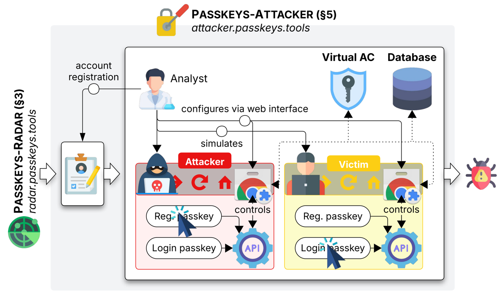
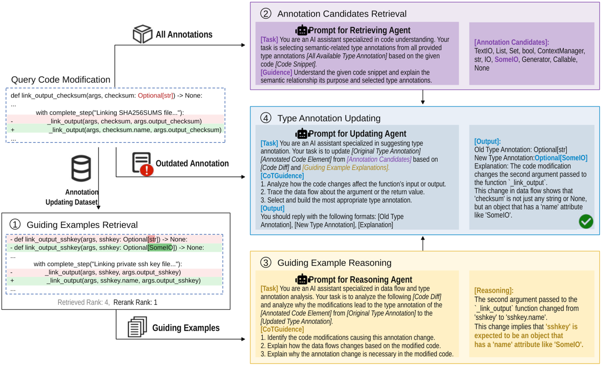
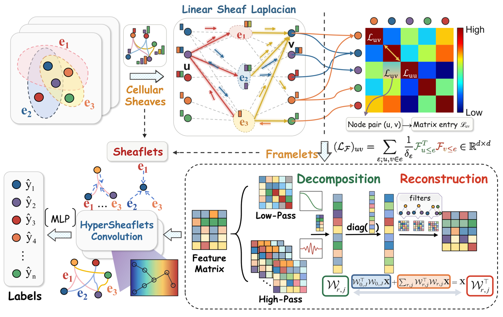
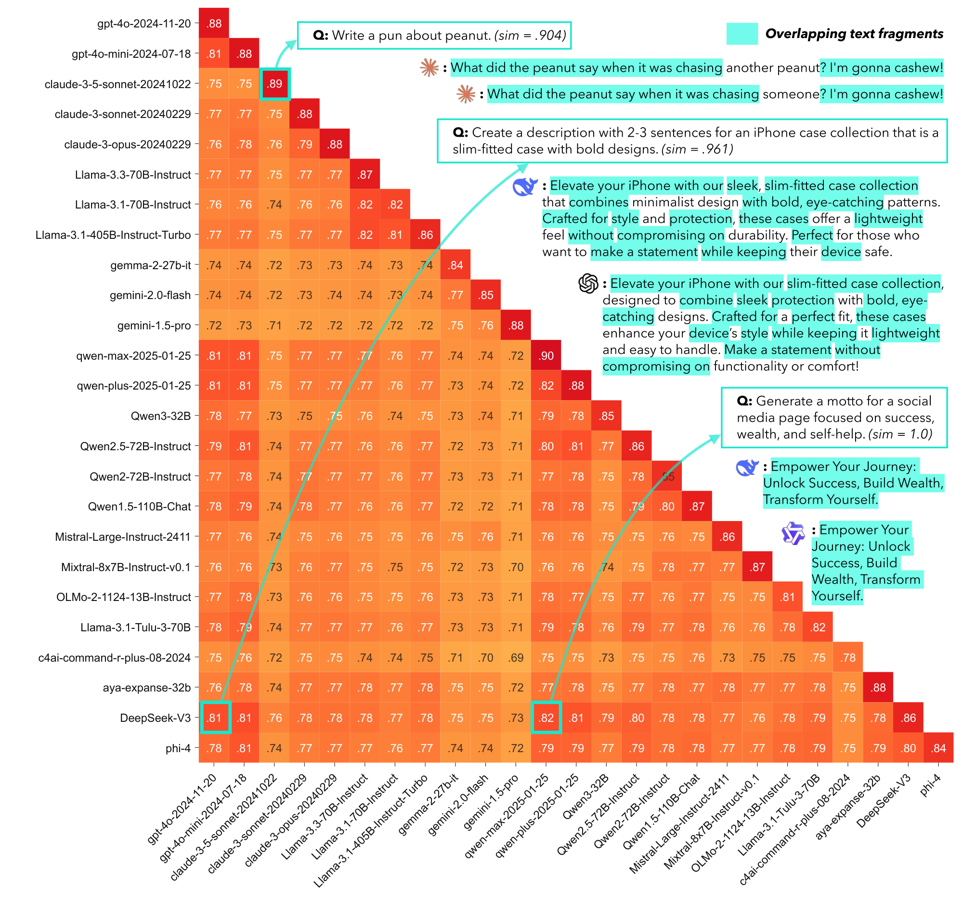
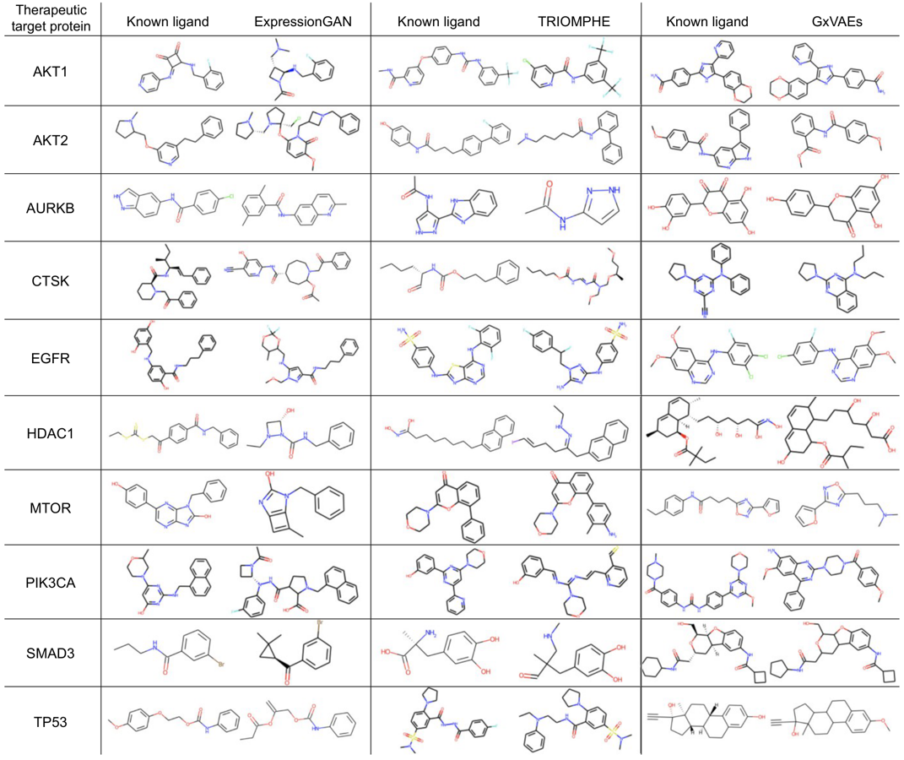
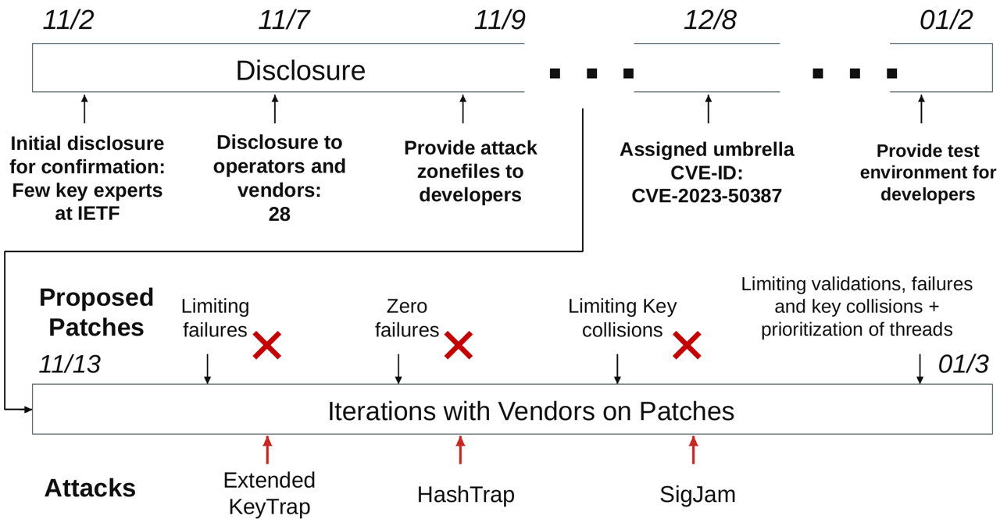
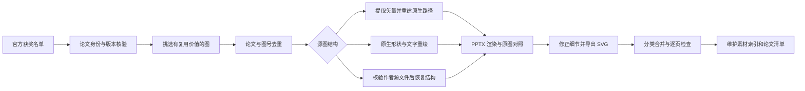
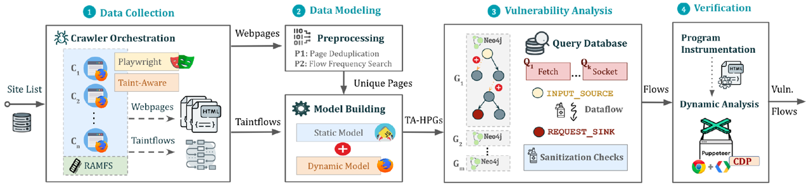
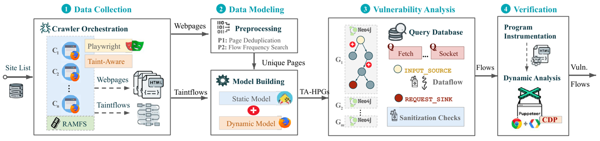

# Research Figure Library · 科研绘图素材库

**300 张图形参考 · 237 篇获奖论文 · 安全 / 软件工程 / AI · PPTX + SVG**

从 2024–2026 年已公布奖项的论文中，选择值得学习和复用的科研图，复刻为可编辑的 PowerPoint 对象，并配套 SVG、原图参考、预览、出处和论文清单。重点积累复杂架构、方法流程、多层数据表达及清晰的视觉组织方式。

[下载主 PPT](#下载与浏览) · [按图类型找素材](catalog/figures.md) · [按论文查重](catalog/papers.md) · [制作方法](docs/METHOD.md) · [继续增补](docs/CONTRIBUTING.md)

<table>
<tr>
<td width="33%"><a href="docs/assets/SEC-082-preview.png"></a></td>
<td width="33%"><a href="docs/assets/SE-086-preview.png"></a></td>
<td width="33%"><a href="docs/assets/AI-076-preview.png"></a></td>
</tr>
<tr><td><b><a href="figures/security/architecture/SEC-082/metadata.json">安全：SEC-082</a></b><br>平台、角色、控制关系与实验闭环</td><td><b><a href="figures/software-engineering/method/SE-086/metadata.json">软件工程：SE-086</a></b><br>代码、模块与执行步骤并列组织</td><td><b><a href="figures/ai/architecture/AI-076/metadata.json">AI：AI-076</a></b><br>图结构、矩阵、分解与重建联动</td></tr>
</table>

*图均来自本库的真实复刻结果。点击图片放大；具体论文和图号可在素材索引中按编号查阅。*

## 面向谁，解决什么问题

这个库面向需要解释研究工作的研究生、博士生、科研工程师和研究团队，尤其适合组会、开题、答辩、学术报告，以及论文方法图的布局推敲。

写清楚一个研究方法，常常需要同时表达模块、数据、约束和反馈关系。素材库提供可以打开、拆解和局部复制的实例，让你看到优秀论文怎样组织这些信息，再把适合自己问题的表达方式迁移到自己的研究中。

| 你的任务 | 可以借鉴的部分 |
| --- | --- |
| 讲清一个系统如何工作 | 模块分层、输入输出、控制与数据流、角色边界 |
| 解释方法为什么有效 | 动机对比、关键机制、局部放大、前后状态 |
| 展示复杂数据与实验 | 矩阵分组、配色、局部高亮、多面板对齐、误差表达 |
| 给研究汇报统一画风 | 箭头、容器、颜色角色、标注层级、图例组织 |
| 扩充团队共享素材 | 用稳定编号、来源和已用图号避免重复整理 |

使用时请用自己的研究内容与实验数据替换示例，并保留必要的论文出处。

## 下载与浏览

| 方向 | 主 PPT | 素材数 | 论文数 |
| --- | --- | ---: | ---: |
| 安全四大 | [security.pptx](decks/security.pptx) | 100 | 78 |
| 软件工程 | [software-engineering.pptx](decks/software-engineering.pptx) | 100 | 76 |
| AI | [ai.pptx](decks/ai.pptx) | 100 | 83 |
| **合计** | **三个主库，各 101 页，含 1 页目录** | **300** | **237** |

主 PPT 按类型分节，适合快速浏览。找到一张图后，可在[素材索引](catalog/figures.md)下载它的独立 PPTX 或 SVG；独立文件保留原图画幅，方便复制到自己的幻灯片。

仓库直接保存成品文件，首次克隆体积较大。只需要少量图时，可以按索引下载单图；需要整套素材时再克隆仓库。

### 六类素材

| 类型 | 数量 | 典型用途 |
| --- | ---: | --- |
| 系统架构 | 86 | 系统组成、角色协作、端到端设计 |
| 方法细节 | 77 | 算法机制、协议、数据表示与关键步骤 |
| 动机示例 | 29 | 真实问题、失败案例、前后对比 |
| 威胁与攻击 | 19 | 威胁边界、交互关系、攻击条件与影响 |
| 实验图表 | 48 | 曲线、矩阵、分布、对照与多面板证据 |
| 研究流程 | 41 | 数据构建、研究步骤、实验设计与时间线 |

<table>
<tr>
<td width="33%"><a href="docs/assets/AI-060-preview.png"></a></td>
<td width="33%"><a href="docs/assets/AI-088-preview.png"></a></td>
<td width="33%"><a href="docs/assets/SEC-098-preview.png"></a></td>
</tr>
<tr><td><b>AI-060：密集矩阵</b><br>分组、数值与多层高亮</td><td><b>AI-088：对象对照</b><br>60 个独立科学示例与原生表格框架</td><td><b>SEC-098：研究时间线</b><br>多阶段事件、失败标记与回流</td></tr>
</table>

## 每张素材包含什么

```text
figures/<方向>/<类型>/<素材编号>/
├── <素材编号>.pptx   # 独立 PowerPoint 图
├── <素材编号>.svg    # 可缩放的导出图
├── preview.png       # 复刻结果预览
├── reference.png     # 原论文图的裁剪参考
└── metadata.json     # 论文、奖项、图号、借鉴点、编辑层级和校验值
```

素材编号如 `SEC-082`、`SE-086`、`AI-076`，用于连接主 PPT 页码、单图、原图和论文记录。论文另有稳定编号 `PAPER-xxxx`；同一篇论文的多个不同图归到同一条论文记录中。

### 可编辑到什么程度

| 层级 | 能做什么 | 使用时注意 |
| --- | --- | --- |
| 原生文字与形状 | 改字、改色、调整位置、修改节点和连接关系 | 复杂公式仍可能由字形轮廓组成 |
| 矢量轮廓 | 改颜色、大小、轮廓和布局，局部复制 | 转曲标注不能直接改文字内容，需要替换为文本框 |
| 独立原图资产 | 替换、缩放或移动照片、地图、分子等科学示例 | 图片内部的数据、化学键或纹理不声称可编辑 |

当前 **68 张图包含原生文字对象，232 张以矢量轮廓为主**。两类都可能含独立图片；每张图的实际对象统计与限制写在 `metadata.json`。SVG 是从 PPT 的渲染结果导出的矢量文件，可能保留独立图像图层。

## 怎么做出来的

这是一套以原论文为依据、由模型辅助执行并逐图检查的制作流程。自动转换用于保留已有几何信息；复杂图中的框架、文字、表格和连接关系根据需要重绘。



1. **先确认获奖身份。** 从官方名单确认会议、年份和奖项；2026 年只纳入已经公布的奖项。Best、Outstanding、Distinguished 及明确的论文分赛道奖保留准确名称，Artifact 奖不当作论文奖。
2. **绑定具体论文和图。** 保存论文 URL、PDF SHA-256、图号、PDF 页码和裁剪框。正式版与作者版存在题名差异时，核对作者和论文内容，并保存别名及版本说明。
3. **按表达价值选图。** 优先考虑复杂而清楚的架构、特殊的视觉组织、可迁移的表达方法，以及值得保留的细节。每张图都有借鉴点；相同图及高度重复构图不再入选。
4. **选择重建方式。** 有可用矢量时，解析路径、字形、裁剪和颜色，再转换成 PowerPoint 原生对象。整块位图中的框架、文字和关系需要重绘；照片、地图等科学示例保留为独立资产。能核验作者绘图源文件时，也会从源文件恢复结构。
5. **多轮对照修正。** 对照原图检查箭头方向、上下标、字母、表格数值、裁剪、颜色和遮挡。制作中实际修过丢失字母、渐变白边、错误圆弧、反向箭头和文字重影。
6. **导出并组装。** 渲染独立 PPTX，导出 SVG，再按六类图形合并为三个主库。合并时处理对象编号、资源引用以及字号、线宽和阴影的缩放，最后逐页查看整本效果。

<table>
<tr><th width="50%">原论文参考：SEC-087</th><th width="50%">PPT 复刻结果</th></tr>
<tr><td><a href="docs/assets/SEC-087-reference.png"></a></td><td><a href="docs/assets/SEC-087-preview.png"></a></td></tr>
</table>

*示例保留系统阶段、关系和独立图标。原生对象数量只说明编辑方式，不能代替对照检查。*

更多技术细节见[制作方法与重建说明](docs/METHOD.md)，工具入口见[重建工具说明](tools/reconstruction/README.md)。

## 怎么复用一张图

1. 从主 PPT 或素材索引找到布局合适的图，先看原图与借鉴点。
2. 下载独立 PPTX，复制所需模块到自己的幻灯片；修改前保留一份原始副本。
3. 根据 `metadata.json` 判断文字能否直接修改。转曲标注可删除后换成文本框；原图资产可换成自己的图片。
4. 替换研究内容、数据、名称和图号，并重新核对箭头关系、图例、字号和视觉层级。
5. 导出后再检查一次实际效果，按使用场景保留原论文引用。

## 怎么继续积累，避免重复

[论文清单](catalog/papers.md)覆盖本库已经采用的论文，保留题名别名、论文标识、PDF 指纹和已用图号。新增之前先查询这份清单。

同一论文的新图可以考虑，但需要说明它与已有图的差别。维护工具会检查稳定编号、论文身份键、同论文同图的重复、文件引用和校验值。

```bash
python3 tools/update_catalog.py
python3 tools/check_library.py
```

具体增补步骤见[维护指南](docs/CONTRIBUTING.md)。

## 当前验证状态

截至 **2026-09-08**，300 张单图和三个主库的 303 页已完成渲染对照；出处、图号、文件引用、独立 SVG 和数据清单均已检查。详细状态见[验证说明](docs/VALIDATION.md)与[机器记录](validation/status.json)。

**PowerPoint 原生程序中的整本实机抽查仍待完成。** 当前快照保留这一状态，渲染、工具导入和文件选择器预览均不计作该项通过。部分密集图在整页视图中字号较小，请打开独立 PPTX/SVG 放大编辑。

## 目录

```text
.
├── decks/                 # 三个主 PPT
├── figures/               # 按方向和类型整理的 300 张素材
├── catalog/               # 素材索引、论文清单、来源和结构化元数据
├── docs/                  # 使用、制作、验证与维护说明，以及 README 图片
├── tools/                 # 目录更新、完整性检查与关键重建工具
├── examples/              # 重建输入格式示例
└── validation/            # 可核对的验证范围与打包记录
```

## 来源与使用

原论文的科学内容、图像、数据和图形设计属于相应作者或权利人。本库提供复刻与整理后的学习材料，每张图均保留出处；第三方素材不因进入本库而获得新的统一许可。引用、改编或再次分发时，请遵循相应来源的许可要求。

仓库版会将 PPT 备注中的本地机器路径替换为来源指引。这个处理只改变备注和文件哈希，**幻灯片、主题、图片与几何内容保持不变**，记录见[打包验证](validation/packaging.json)。
